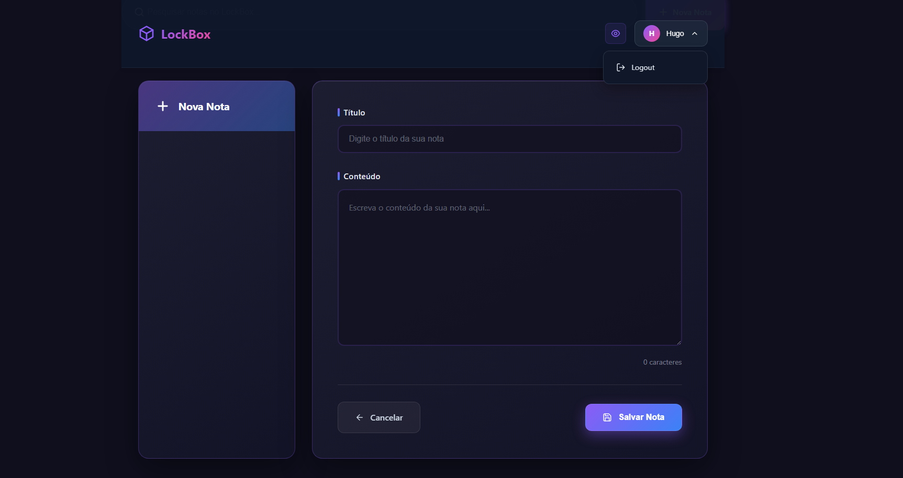
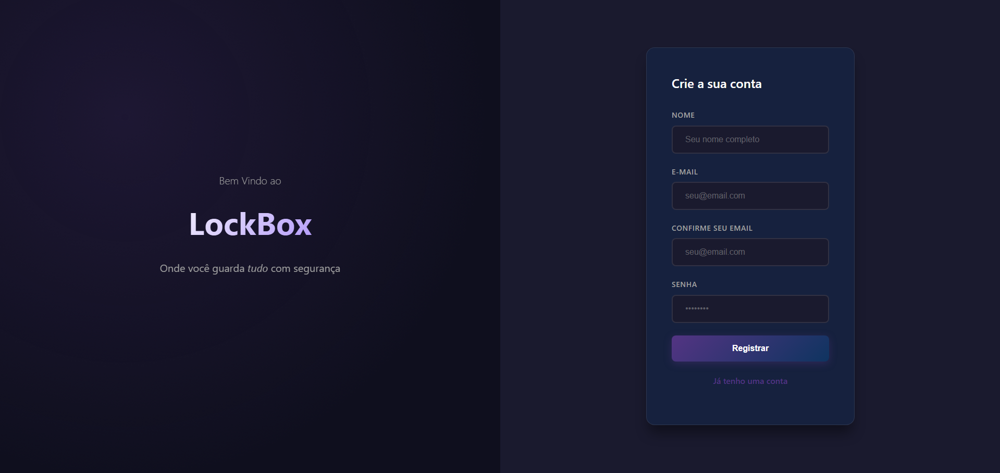
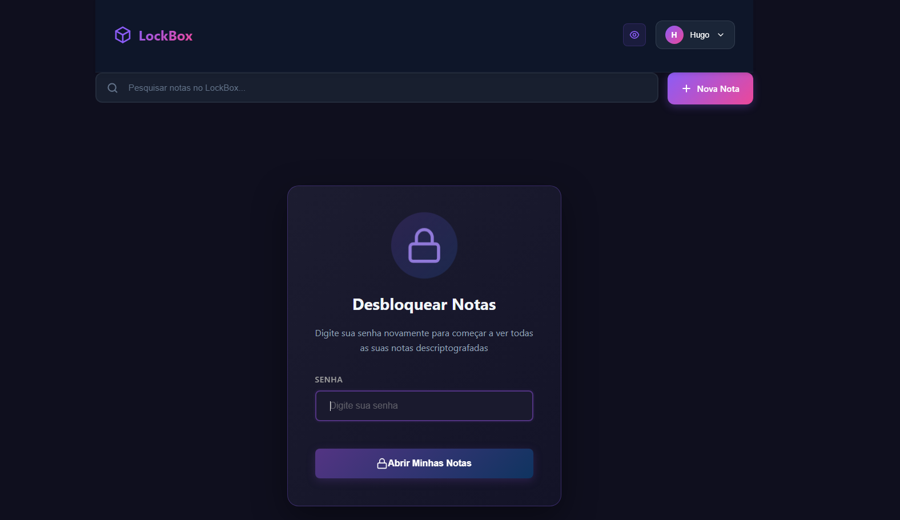

# LockBox — Gerenciador de Notas Criptografadas

Aplicação web para criar e gerenciar **notas privadas** com **login/registro**, **busca**, **tema dark** e **criptografia no servidor**.  
Stack: **HTML**, **CSS + DaisyUI (Tailwind)**, **PHP**, **Composer**, **MySQL** e **JavaScript**.

## ✨ Funcionalidades

- 👤 Autenticação: **registrar, login, logout**.
- 📝 Notas: **criar, listar, buscar, atualizar e deletar**.
- 🔐 **Criptografia AES-256** (lado do servidor) para o conteúdo das notas.
- 🌙 UI com **DaisyUI** (tema escuro responsivo).
- 🔎 **Busca** por título/conteúdo.
- 🗑️ Soft delete (opcional) e confirmação antes de excluir.
- ⏱️ Metadados: data de criação/atualização.
- 📱 Layout responsivo.

> Screenshots ficam em `docs/screenshots/`.  
> Ex.:  
> 

---

## 📦 Tecnologias

- **PHP 8+** (servidor)
- **Composer** (autoloader/depêndencias)
- **MySQL 8+**
- **HTML5 / CSS3 + DaisyUI**
- **JavaScript (vanilla)**

## 🗄️ Banco de Dados

O projeto inclui o arquivo [`database/lockbox.schema.sql`](database/lockbox.schema.sql),  
que cria automaticamente o banco **lockbox**, as tabelas e um usuário de demonstração.

**Usuário de teste:**

Email: demo@lockbox.local

Senha: 123456

Para importar o banco, basta abrir o arquivo `.sql` no **phpMyAdmin** e clicar em *Importar*.

---

## 🖼️ Demonstração

> Algumas telas do sistema (login, registro e dashboard de notas)

---
